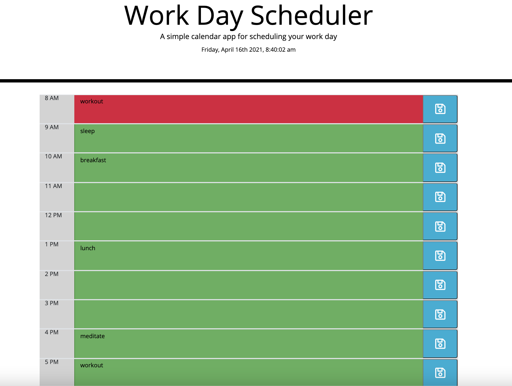
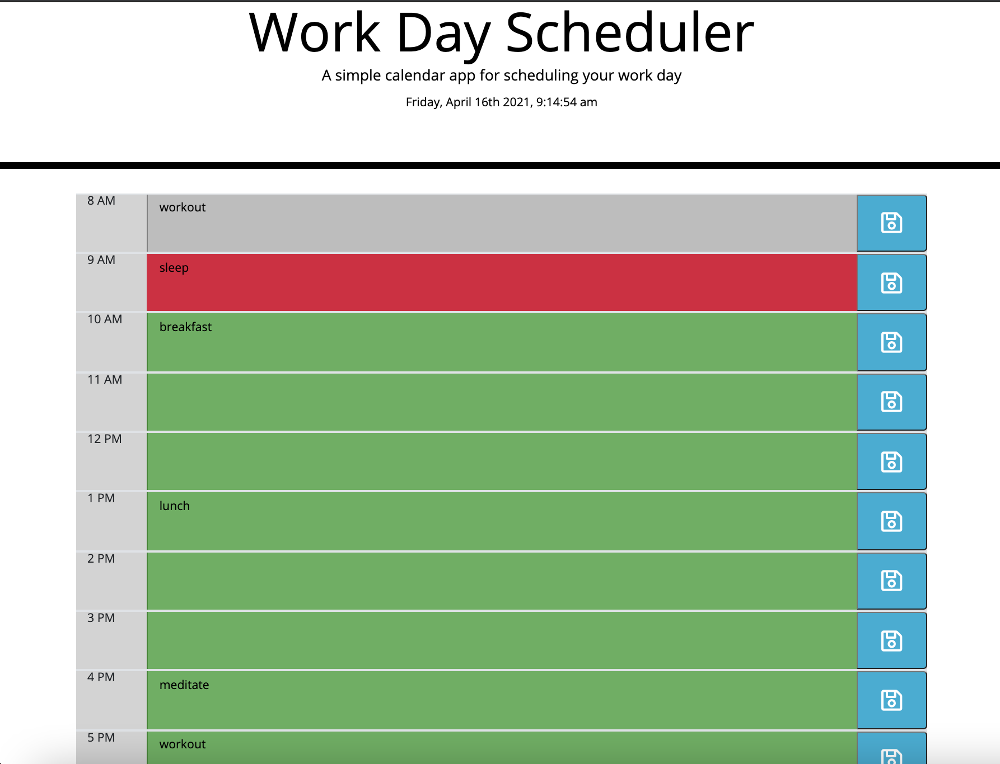

# workday_scheduler 
test push to git 
created container for time 8am block 
added row amount to container 
added bootstrap grid option to container 
copied container amount to match office hour amounts 
created let variables per container 
created ready function 
created string for date layout 
let variable created for time and date block  
listener for text area click created 
created an hour string to read as a 12 hour format 
created a string to load and save to local storage 
changed color codes for past, present, and future times 
created assets folder for css and javascipt sheets 
added screen shot 
direct repo - https://github.com/Jrvillena/workday_scheduler 
landing page - https://github.com/Jrvillena/workday_scheduler/tree/master 
 
